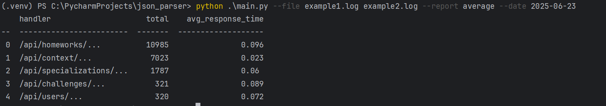

#  Парсер логов


##  Содержание

- [Краткое описание](#краткое-описание)
- [Пример лога](#пример-лога)
- [Запуск скрипта](#запуск-скрипта)
- [Пример запуска скрипта](#пример-запуска-скрипта)
- [Особенности обработки ошибок](#особенности-обработки-ошибок)
- [Расширение скрипта](#расширение-скрипта)
- [Тестирование](#тестирование)


## Краткое описание

Скрипт для создания отчетов по лог-файлам 
с логами в формате JSON. 

Реализован на данный 
момент единственный отчет "average", который выводит кол-во
и среднее время по запросам на каждый из url по всем 
переданным в скрипт файлам с фильтрацией по дате. 
Отчет упорядочен по уменьшению количества запросов, 
строки нумерованы начиная с нуля. 

## Пример лога
{"@timestamp": "2025-06-22T14:10:11+00:00", 
"status": 200, "url": "/api/homeworks/...", 
"request_method": "GET", "response_time": 0.04, 
"http_user_agent": "..."}

## Запуск скрипта
Для запуска необходимо ввести в консоли "python" название 
файла скрипта (main.py), обязательно указать файлы после "--file" 
(это название файлов в корневой директории скрипта, 
либо относительный путь до них), обязательно указать 
название(тип) отчета после "--report"(на данный момент доступен 
только "average"). Также можно опционально отфильтровать по дате
указав ее после "--date".


Пример:
```bash
python main.py --file 1.log 2.log --report average --date 2025-01-01
```

## Пример запуска скрипта


## Особенности обработки ошибок
Скрипт не выбрасывает ошибки, но осуществляет выход из 
программы с кодом ошибки "sys.exit(1)", при этом пишет 
сообщения в "sys.stderr". 

Скрипт обрабатывает ошибки валидации данных при вводе 
в консоль, в частности поля report и file обязательные, 
report может быть только из списка, а дата должна 
соответствовать формату ГГГГ-ММ-ДД.

В списке файлов могут присутствовать несуществующие 
или нечитаемые файлы. В этом случае скрипт все равно будет 
выполняться, но проигнорирует файлы, которые не сможет открыть. 
Если ни один файл не возможно открыть, то программа закроется.

В случае ошибок чтения отдельных строк программа не закроется, 
а проигнорирует их (с сообщением в sys.stderr), то же касается 
обработки значений при построении отчета. 

## Расширение скрипта
Скрипт достаточно легко расширяется за счет того, что отчет реализован 
через класс. Конкретный отчет наследуется от абстрактного класса 
Report. Выбор отчета происходит посредством фабрики отчетов.
Таким образом для добавления нового отчета нужно создать класс отчета, 
добавить выбор отчета в словарь reports в report_factory. После этого 
необходимо скорректировать choices в обработке аргумента --report 
(строка 27 main.py). Также можно добавлять новые фильтры расширяя класс
FilterPipeline либо используя имеющиеся методы add_equal и add_contains,
что потребует добавления аргументов считываемых из CLI в функции main. 

## Тестирование
Скрипт протестирован, процент покрытия по pytest-cov 98% 
(всего 28 тестов).
